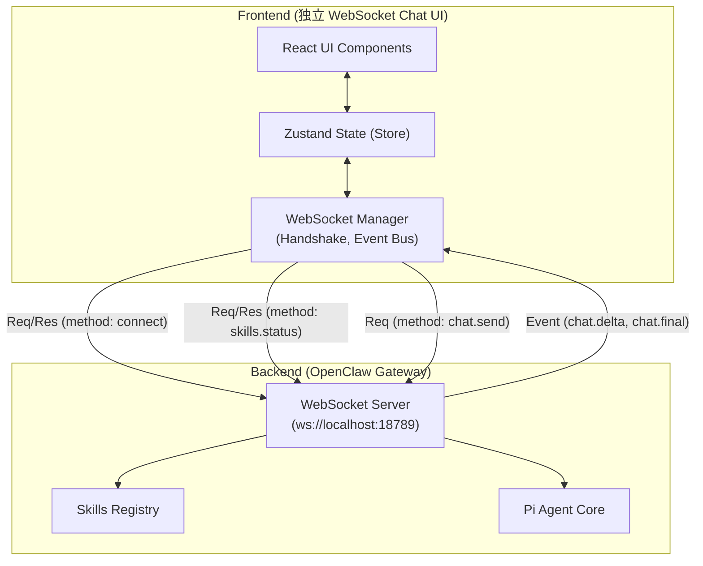

# 1. 架构设计
此项目作为一个纯前端应用，通过浏览器的 WebSocket API 与本地运行的 OpenClaw Gateway 建立 RPC/Event 风格的双向通信。



## 2. 技术说明
- **前端框架**: React@18 + Vite (使用 `react-ts` 模板)
- **UI 样式**: Tailwind CSS v3 (采用 Brutalist 深色主题，定制化等宽字体)
- **状态管理**: Zustand (用于集中管理 WS 连接状态、Skill 列表和 Chat Messages 记录)
- **通信核心**: 原生 `WebSocket` 对象封装。使用 `uuid` 库生成请求的 `id` 和 `idempotencyKey`。
- **图标与辅助**: `lucide-react` 用于简约图标，`react-markdown` 用于渲染助手回复的代码和格式。

## 3. 路由定义
作为聚焦于 WebSocket 交互的工具型页面，采用单页设计，无需前端路由。
| 路由 | 用途 |
|-------|---------|
| `/` | WS 控制台主页，集成了侧边栏(Skills)和主区(Chat) |

## 4. API / WebSocket 协议定义
使用 OpenClaw 官方的 WebSocket Frame 格式。所有消息包裹在 `{ type, id, method, params }` 结构中。

### 4.1 握手 (Handshake)
- **Request**:
  ```json
  { "type": "req", "id": "uuid", "method": "connect", "params": {} }
  ```
- **Response**: 接收到服务端返回的连接确认。

### 4.2 获取 Skills (skills.status)
- **Request**:
  ```json
  { "type": "req", "id": "uuid", "method": "skills.status", "params": {} }
  ```
- **Response**: 返回当前系统中可用的 skills 列表。

### 4.3 发送聊天 (chat.send)
- **Request**:
  ```json
  {
    "type": "req",
    "id": "uuid",
    "method": "chat.send",
    "params": {
      "sessionKey": "ws-client-session",
      "message": "用户输入的文本",
      "idempotencyKey": "uuid"
    }
  }
  ```

### 4.4 接收流式事件 (chat.delta & chat.final)
- **Event**: 服务端主动推送的 Broadcast 消息，包含打字机片段。
  ```json
  {
    "type": "event",
    "event": "chat.delta",
    "payload": {
      "message": { "role": "assistant", "content": "流式文本片段..." }
    }
  }
  ```

## 5. 项目结构约定
为保持纯净的开发环境，我们在之前的 `/workspace/chat-ui` 基础上进行重构：
- `/workspace/chat-ui/src/lib/websocket.ts`: 封装底层的 WS 连接逻辑、握手、请求 Promise 化（通过请求 ID 匹配响应）。
- `/workspace/chat-ui/src/store/wsStore.ts`: 存储当前连接状态、获取到的 Skills 数据和会话流。
- `/workspace/chat-ui/src/components/`: `TerminalLayout`, `SkillSidebar`, `ChatArea`, `PromptInput` 等极客风 UI 组件。
