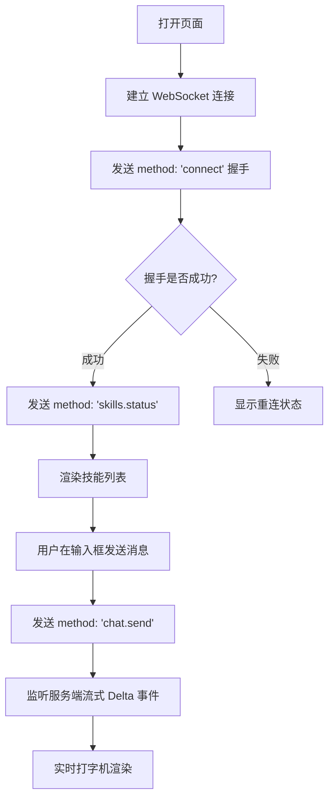

# 1. 产品概述
构建一个极简、科技感且具有极高设计美学的 Web 单页应用，通过 WebSocket 协议直接与本地 OpenClaw 建立长连接。
- **主要目的**：实现基于 WebSocket 的无缝实时聊天体验，并能动态获取当前 OpenClaw 支持的 Skills（技能/工具）列表。
- **目标用户**：开发者、AI 极客，需要调试或体验 OpenClaw 原生 WebSocket 协议特性的用户。
- **设计风格**：采用 Brutalist (粗野主义) 或高冷科技感 (Tech-noir)，深色模式为主，打破常规的 AI 聊天界面。

## 2. 核心功能

### 2.1 功能模块
1. **连接管理模块**: 建立与 `ws://localhost:18789` 的 WebSocket 握手 (`connect` method)，并实时显示连接状态（在线、离线、重连中）。
2. **Skills (技能) 面板**: 左侧或顶部抽屉，调用 `skills.status` 或 `tools.catalog` 获取并展示当前可用的技能列表，带出硬核的数据面板风格。
3. **实时会话 (Chat) 模块**: 核心聊天区域，使用 `chat.send` 方法发送消息，并监听服务端的事件流（如 `chat.delta`, `chat.final` 等）来渲染打字机效果。

### 2.2 页面详情
| 页面名称 | 模块名称 | 功能描述 |
|-----------|-------------|---------------------|
| 主控制台 | 连接状态指示器 | 脉冲发光点，显示 WebSocket 实时连接健康度 |
| 主控制台 | 技能/工具侧边栏 | 列表化展示系统拥有的 Skill，点击可查看详情或复制 ID |
| 主控制台 | 对话时间线 | 聊天气泡记录，助手回复支持 Markdown，带光晕动效 |
| 主控制台 | 命令行输入框 | 底部固定输入区，支持多行，回车发送，极客风格的光标 |

## 3. 核心流程
WebSocket 交互核心流：
1. 页面加载 -> 连接 `ws://localhost:18789`
2. WebSocket `onopen` -> 发送 `connect` 握手包。
3. 握手成功 -> 发送 `skills.status` 请求获取技能列表。
4. 用户输入文字 -> 组装带有 `sessionKey` 和 `idempotencyKey` 的 `chat.send` 消息包并发送。
5. 监听服务端的 Broadcast 事件 -> 将 `delta` 片段实时追加到当前会话气泡中。

## 4. 用户界面设计
### 4.1 设计风格
- **整体基调**：深色科技风 (Dark Cyber/Tech-noir)，主色调为深黑 (`#0a0a0a`)，辅以荧光绿 (`#00ff66`) 或电光蓝 (`#00f0ff`) 作为强调色。
- **排版 (Typography)**：使用等宽字体 (Monospace，如 Fira Code, JetBrains Mono) 渲染代码和系统信息，主文本使用清晰的无衬线体。
- **空间构成**：不对称或严格的网格化布局，左侧为窄边栏（技能列表），右侧宽区为会话区。大量使用细边框 (1px border) 和直角，摒弃传统的圆角和阴影。
- **动效 (Motion)**：输入时光标闪烁，接收消息时文字逐个弹出的极客终端效果。状态指示器有呼吸/脉冲动效。

### 4.2 页面设计概览
| 页面名称 | 模块名称 | UI 元素 |
|-----------|-------------|-------------|
| 主控制台 | 导航/Header | 左侧闪烁的 "OpenClaw.WS_LINK" 字样，右侧连接状态指示灯 |
| 主控制台 | 左侧 Skills 面板 | 带有细边框的列表项，等宽字体显示 Skill ID 和状态 |
| 主控制台 | 主 Chat 区 | 无界面的流式对话展示，极简的文本排版，不同角色用颜色区分 |
| 主控制台 | 终端输入区 | 底部的 `<textarea>`，带 `>` 提示符，无边框，获焦时整行高亮 |

### 4.3 响应式要求
- 桌面端：左侧栏 (25%) + 右侧聊天区 (75%) 的经典网格。
- 移动端：侧边栏默认隐藏，可通过顶部按钮呼出 (Drawer)。输入框吸底。
